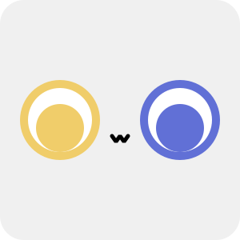

---

# Laana

Modern protocol for chatbot development, based on [ProtoBuf](https://protobuf.dev/).

为聊天机器人开发而生的现代化协议，基于 [ProtoBuf](https://protobuf.dev/)。

Laana 协议的名称源自虚拟角色、武士道旗下 MyGO!!!!! 乐队的主音吉他手要乐奈（かなめ　らーな），亦是一位“猫系少女”。Logo 亦是以要乐奈的形象（异色瞳，猫猫嘴）为基础设计的。

## 支持矩阵

### 语言支持

| Language   | Definition                                                  | Client  |
|------------|-------------------------------------------------------------|---------|
| JavaScript | [Yes](https://www.npmjs.com/package/@laana-proto/def)       | Pending |
| C#         | [Yes](https://www.nuget.org/packages/LaanaProto.Definition) | Pending |
| Python     | Pending                                                     | Pending |

### 框架支持

- 协议端
  - [NapCatQQ](https://github.com/NapNeko/NapCatQQ/tree/laana) (Official support, under development)
  - [Lagrange.Core](https://github.com/Wesley-Young/Lagrange.Laana) (Official support, under development)
- 应用端
  - NoneBot2 (Official support, Pending)
  - Koishi (Official support, Pending)

## 开发

### 如果你是协议实现者...

请参阅 `proto` 文件夹下的 `.proto` 文件，以了解 Laana 协议的具体内容；同时，请参阅 [`docs` 文件夹](./docs/README.md)下的文档，以了解实现 Laana 协议的具体细节。

### 如果你是聊天机器人开发者...

相比于阅读本文档，你更应该关注应用端框架的文档。目前，Laana 并没有在任何应用端框架中得到实现，编写适配器的工作也尚未开始。如果你对此感兴趣，欢迎加入我们。