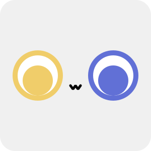

---

# Laana

Modern protocol for chatbot development, based on [ProtoBuf](https://protobuf.dev/).

为聊天机器人开发而生的现代化协议，基于 [ProtoBuf](https://protobuf.dev/)。

Laana 协议的名称源自虚拟角色、武士道旗下 MyGO!!!!! 乐队的主音吉他手要乐奈（かなめ　らーな），亦是一位“猫系少女”。Logo 亦是以要乐奈的形象（异色瞳，猫猫嘴）为基础设计的。

## 术语表

- **Laana**: 聊天机器人开发协议。
- **Uin**: 所谓的 QQ 号，无符号 32 位整数，但在 QQNT 内部实现中多以字符串形式传递。
- **Uid**: QQNT 内部另一套更加常用的用户标识，为遵循一定格式的字符串。
- **User**: 用户，包括陌生人、好友和群成员。
- **Buddy**: 好友。选用此词是因为该词在 QQNT 内部的代码中被广泛使用。
- **Message**: 消息。一条“消息”是指出现在聊天框中的最小不可分单位，可以是文本消息、图文混排消息、图片消息、语音消息、视频消息、文件消息等。
- **Bubble**: 气泡。用以代指纯文本或图文混排消息，与图片、语音、视频、文件等消息**并列**。
- **Segment**: 消息段。指气泡消息中的最小不可分单位，可以是纯文本、表情、图片和 At（“提到”某人）。这一点与 OneBot 11 标准有很大不同，因为 OneBot 11 中的消息段还可以是语音、视频、文件等，这给消息处理带来了很大的复杂性。实际上 QQ 中的图文消息中是不可能包含语音、视频、文件等的。
- **Event**: 事件，指外界变化对 Bot 造成的影响。事件可以是消息事件、好友事件、群事件等。
- **Action**: 动作，指 Bot 的拉取信息、响应时间等行为，与常规编程中的“函数”类似。动作可以是发送消息、获取好友列表、获取群列表等。
- **Ping**: 执行一个动作所要发送的信息，与常规编程中的“参数”类似。
- **Pong**: 执行一个动作后返回的信息，与常规编程中的“返回值”类似。